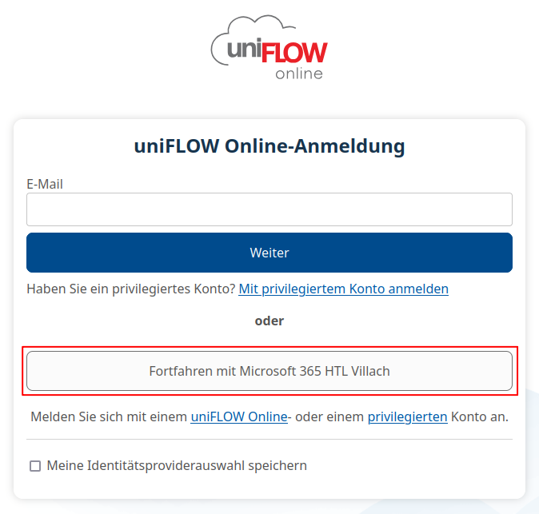
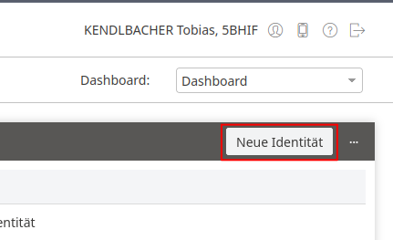
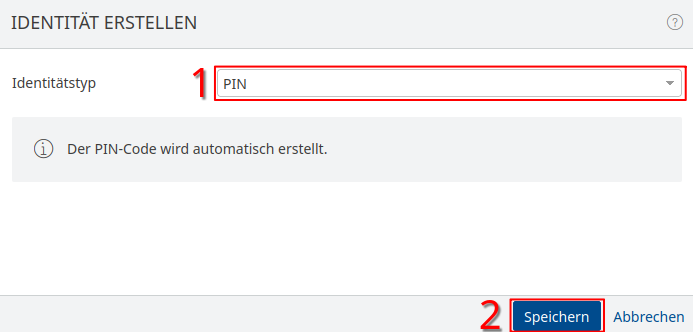
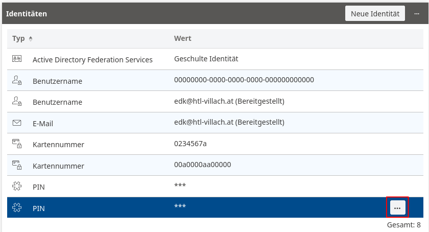
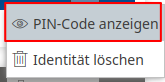
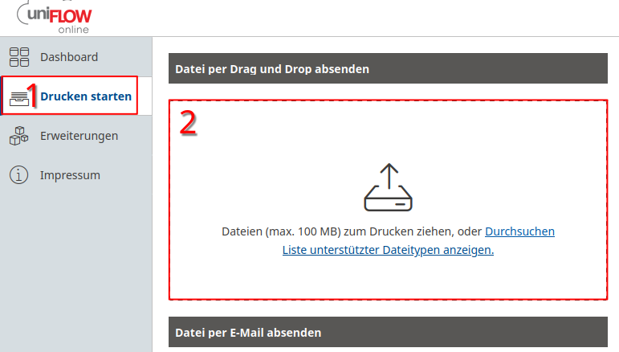

## Was brauche ich zum Drucken?

- NFC-fähige Karte oder Chip (Kreditkarte kann ohne Bedenken verwendet werden)
- Druckguthaben (wurde normalerweise am Anfang des Schuljahres eingesammelt)
- Handy oder Laptop mit Internet

## Wie richte ich meine Karte ein?

Zuerst loggst du dich im [Online-Druckerportal](https://htl-villach.eu.uniflowonline.com/Login?ReturnUrl=%2F&) mit deinem Schulaccount ein. Dazu klickst du einfach auf [diesen Link](https://htl-villach.eu.uniflowonline.com/Login?ReturnUrl=%2F&) und wählst dann die Option **"Fortfahren mit Microsoft 365 HTL Villach"**.

Sobald du dich fertig angemeldet hast, landest du auf der Startseite des Druckerportals. Jetzt erstellen wir einen Kartenregistrierungscode, mit dem du deine Karte mit deinem Account verbindest. Es wird nichts auf diese Karte geschrieben, also kannst du auch deine Kreditkarte verwenden, falls du keine andere Möglichkeit hast.

Drücke auf **"Neue Identität"**:

Wähle anschließend im Fenster den Identitätstyp **"PIN"** aus und drücke auf **"Speichern"**:

Jetzt kannst du dir unter den Identitäten deinen Kartenregistrierungscode mit den folgenden Schritten anzeigen lassen:

Geh jetzt zum Drucker und halte deine Karte über das Lesegerät, dann solltest du nach deiner PIN gefragt werden. Diese Schritte müssen pro Karte nur ein Mal ausgeführt werden.

## Drucken

Nachdem deine Karte nun registriert sein sollte, kannst du Dokumente ausdrucken, indem du diese im Druckerportal hochlädst *oder* per Mail an das Druckersystem sendest. Für Letzteres sende einfach eine E-Mail von deiner Schulmail an `mobileprint@htl-villach.eu.uniflowonline.com`.

Sobald du deine Dateien hochgeladen hast, kannst du diese am Drucker mit der Option **"Sicheres Drucken"** ausdrucken.  
Es ist außerdem jederzeit möglich, mit **"Scannen an E-Mail"** Dokumente einzuscannen.
